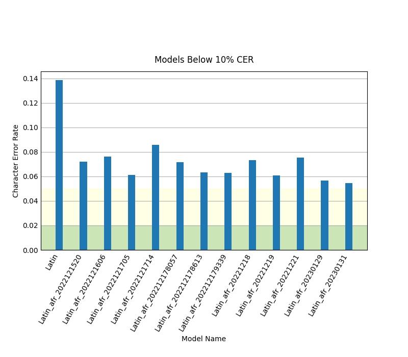

# Testing

## Evaluation Using *jiwer* Module




> - Chart data gathered from [data/evaluation/data.csv](data/evaluation/data.csv)
> - data.csv populated from evalutation of files in [data/evaluation/\<iso_langname\>](data/evaluation).

### Shortcomings

- i + grave accent commonly recognized as either i + macron-grave or dotless i + grave

> 1. This testing has been done without any image preprocessing (e.g. increasing contrast to remove specks that could be confused for characters). It has also not made use of tesseract's character blacklist or whitelist features, which in some cases would significantly reduce substitution and/or insertion errors.

### Commands

```bash
(env) $ # Verify that all models have been used and evaluated with all image/GT pairs.
(env) $ ./scripts/scan-data.py
(env) $ ./scripts/scan-data.py
Base dir: /home/nate/g/ocr/data/evaluation
  Running OCR evaluations for Latin...
  [...]
(env) $ # Create charts to summarize data.
(env) $ ./scripts/show-chart.py         # all models summary chart
(env) $ ./scripts/show-chart.py comp    # Latin vs best comparison chart
```
