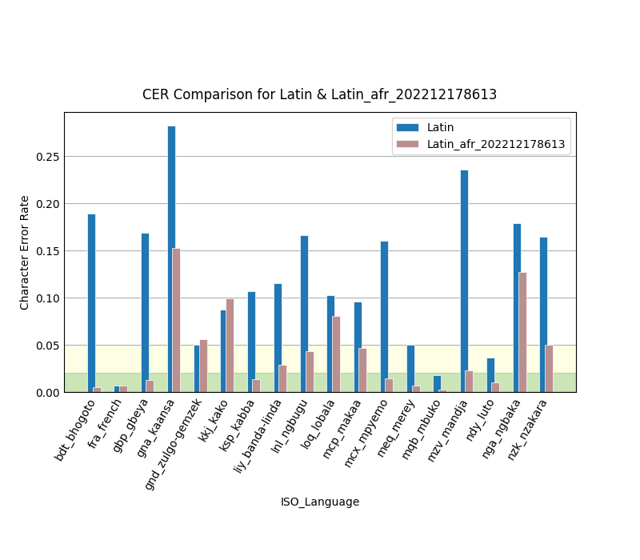

# OCR for African Latin-based writing systems

Download the current language model: [Latin_afr.traineddata](https://github.com/sil-car/ocr/raw/main/tessdata/Latin_afr.traineddata)

A character-based OCR solution for Latin-based writing scripts in Africa. This language model is based on **Tesseract's** Latin script language model, then improved with additional training on synthetic data generated from Unicode characters used in the central African region. More details at [Training.md](Training.md).

## Goals

1. Develop an accurate system for OCRing text at the character level from documents produced/discovered in the central Africa region. (Theoretically, this could apply to *any* language that uses a Latin-based script, but the generated training data will only explicitly consider characters important to the central Africa region.)
1. Ideally, allow for the OCR scope to be narrowed by a specific language's given character set.

## Language Model Evaluation



Summary comparison results can be seen in [Evaluation.md](Evaluation.md).

Full comparison results can be found in [data/evaluation/](data/evaluation/)

## Usage

1. Install **Tesseract** on your system. How to do this depends on your OS.
1. Copy the above model into **Tesseract's** *tessdata* folder; e.g.
   ```
   $ sudo wget https://github.com/sil-car/ocr/raw/main/tessdata/Latin_afr.traineddata -O /usr/share/tesseract-ocr/4.00/tessdata/Latin_afr.traineddata # on Ubuntu/Wasta 20.04
   ```
   This will install the current best model using the name "Latin_afr". Windows users will need to adapt the instructions to their particular setup.
1. Use the model with **Tesseract**; e.g.
   ```
   $ tesseract -l Latin_afr image.png
   ```
You can also make use of other front-end apps that use **Tesseract** as a back end. Just select "Latin_afr" as the language/script to be recognized after having copied the model to the appropriate tessdata folder.

## Background

**[Tesseract](https://github.com/tesseract-ocr)** seems to be a reasonable option for character-based OCR work because it provides script-based "language" options while other solutions use are strictly language-based. But when **Tesseract** was tried on a document in a central African language with a Latin-based script (Banda-Linda [liy]) it clearly struggled to properly identify less-common Latin script characters (e.g. ɓ, ɗ, ɛ, ə, ŋ, ɔ), as well as both those and more-common glyphs that were combined with various diacritics. Nevertheless, **Tesseract** was still able to properly identify *~90%* of the Banda-Linda characters using the "Latin" language option.

## Scope

From an end-user perspective it would be great to have a graphical, cross-platform app than can reliably perform these steps:
1. Recognize text blocks in an image or PDF document, regardless of columns, text orientation, etc.
1. Recognize all Latin script characters within these text blocks, regardless of language.
1. Export the text to a text file.
1. Optionally export the results, including images, to a searchable PDF.
1. Optionally export the results, including images, to an editable document format, such as ODT.

This repository will only focus on Step 2: OCR proper using **Tesseract**. Later, various GUI apps can be evaluated depending on specific end user needs.

## Defining accuracy

OCR accuracy can be measured in a few different ways. Since we are concerned with
an OCR solution at the writing script-level (i.e. character level) rather than one
at the word-level, we will focus on the Character Error Rate (CER).

The CER is composed of 5 quantities:
1. N: number of characters in source text (or ground truth text)
1. C: number of correctly recognized characters
1. S: number of substitution errors (i.e. wrong character was recognized)
1. D: number of deletion errors (i.e. character was left out of results)
1. I: number of insertion errors (i.e. character was added to results)

The simple CER is calculated as follows:
```py
CER = (S + D + I) / N
```
or
```py
CER = (S + D + I) / (C + S + D) # used by jiwer
```

However, this can result in a CER > 100% if there are many insertion errors. So
an alternative *Normalized CER* can be calculated as follows:

```py
CERn = (S + D + I) / (S + D + I + C)
```

Ideally, this solution will prove to be **98%-99%** accurate; i.e. CER <= 2%.
*Further reading:*
- *http://www.dlib.org/dlib/march09/holley/03holley.html*
- *https://towardsdatascience.com/evaluating-ocr-output-quality-with-character-error-rate-cer-and-word-error-rate-wer-853175297510*

## Character set & font list

See [Training.md](Training.md) and [data/Latin_afr/fonts.txt](data/Latin_afr/fonts.txt).
